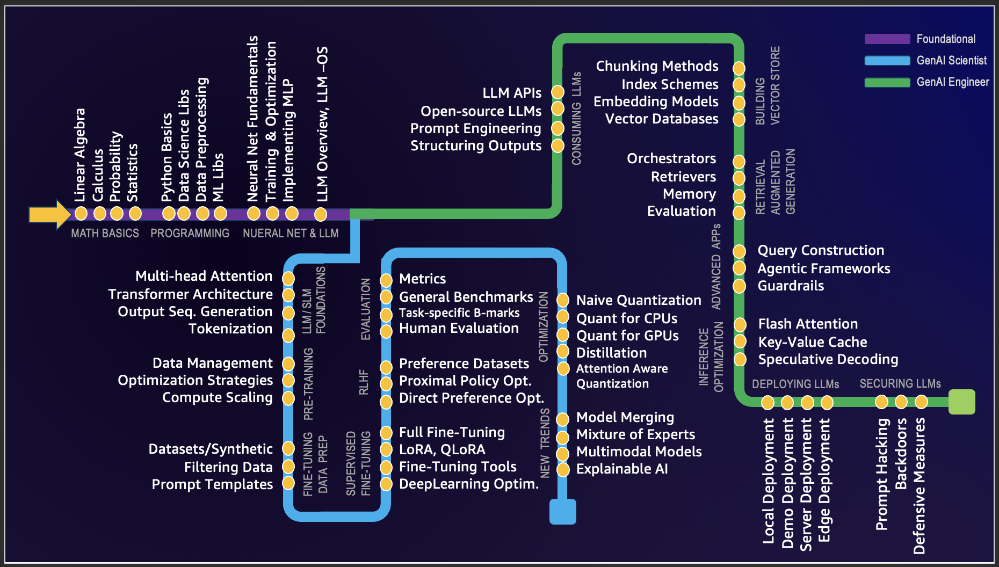

# GenAI Learning Metromap

> Welcome to the GenAI Learning Metromap! Navigating the field of GenAI can often feel daunting due to the interconnected concepts that require prior understanding. This guide aims to streamline the learning journey by mapping out these dependencies, helping to minimize cognitive overload. While there are numerous ways to structure such a learning path, this approach has worked for me. If you have ideas for improvement or alternative perspectives, I welcome your [feedbacks](mailto:spraja08@gmail.com). 

## Foundational

### 1. MATH BASICS
* **Linear Algebra:** Crucial for understanding deep learning algorithms. Key concepts include vectors, matrices, determinants, eigenvalues and eigenvectors, vector spaces, and linear transformations
* **Calculus:** Machine learning algorithms involve the optimization of continuous functions, which requires an understanding of derivatives, integrals, limits, and series. Multivariate calculus and the concept of gradients are also important.
* **Probability and Statistics:** For understanding how models learn from data and make predictions. Key concepts include probability theory, random variables, probability distributions, expectations, variance, covariance, correlation, hypothesis testing, confidence intervals, maximum likelihood estimation, and Bayesian inference.

📚 **References:**  
* [Why Machines Learn: The Elegant Math Behind Modern AI](https://a.co/d/3IKwY5X)BOOK
* [StatQuest with Josh Starmer](https://www.youtube.com/@statquest)
* [And ofcourse, the quintessential "3Blue1Brown"](https://www.youtube.com/@3blue1brown)

---
2. **PROGRAMMING**
   - *Python Basics:* A good understanding of the basic syntax, data types, error handling, and object-oriented programming.
   - *Data Science Libraries:* Includes NumPy for numerical operations, Pandas for data manipulation and analysis, Matplotlib and Seaborn for data visualization.
   - *Data Pre-processing:* Feature scaling and normalization, handling missing data, outlier detection, categorical data encoding, and splitting data into training, validation, and test sets.
   - *Machine Learning Libraries:* Scikit for traditional ML algos and Pytorch for Deeplearning. Understanding how to implement algorithms like linear regression, logistic regression, decision trees, random forests, k-nearest neighbours (K-NN), and K-means clustering is important. Dimensionality reduction techniques like PCA and t-SNE are also helpful for visualizing high-dimensional data

📚 **References:**  
   - [Automate the Boring Stuff with Python](https://automatetheboringstuff.com/)  
   - [Python for Data Analysis by Wes McKinney](https://wesmckinney.com/book/)FREE BOOK  
   - [Introduction to Machine Learning with Python by Andreas Müller and Sarah Guido](https://shop.oreilly.com/product/0636920030515.do)BOOK  
   - [Pytorch Tutorials](https://pytorch.org/tutorials/)
  
3. **NEURAL NETs & LLMs**
   - *Nueral Net Fundamentals:* Components of a neural network such as layers, weights, biases, and activation functions (sigmoid, tanh, ReLU, etc.)
   - *Training & Optimization:* Backpropagation and different types of loss functions, like Mean Squared Error (MSE) and Cross-Entropy. Understanding various optimization algorithms like Gradient Descent, Stochastic Gradient Descent, RMSprop, and Adam. Understanding the concept of overfitting (where a model performs well on training data but poorly on unseen data) and learn various regularization techniques (dropout, L1/L2 regularization, early stopping, data augmentation) to prevent it.
   - *Implementing MLPs:* Building a Multi Layer Perceptron, also known as a fully connected network, using PyTorch.
   - *LLM Overview & LLM-OS:*  The core technical component behind systems like ChatGPT, Claude, and Bard. What they are, where they are headed, comparisons and analogies to present-day operating systems.

📚 **References:**  
   - [The Spelled-out Intro to Neural Networks](https://www.youtube.com/watch?v=VMj-3S1tku0&list=PLAqhIrjkxbuWI23v9cThsA9GvCAUhRvKZ)  
   - [Intro to Large Language Models](https://www.youtube.com/watch?v=zjkBMFhNj_g&t=2750s)
   - [The State of GPT](https://www.youtube.com/watch?v=bZQun8Y4L2A&list=PLAqhIrjkxbuWI23v9cThsA9GvCAUhRvKZ&index=8)
  

## GenAI Scientists Path
4. **LLM/SLM FOUNDATIONS**
   - *Multi-head Attention:* The attention mechanism allows a model to focus on relevant parts of the input sequence when predicting outputs. In Transformers, the Scaled Dot-Product Attention is the core mechanism, where each token attends to every other token in the sequence, weighted by learned relevance scores.
   - *Transformer Architecture:* The Transformer is a neural network architecture introduced in the [Attention Is All You Need](https://arxiv.org/abs/1706.03762) paper. It relies entirely on the attention mechanism to draw global dependencies between input and output. It eliminates recurrence and convolutions, allowing for parallelization and scalability in deep learning.
   - *Output Sequence Generation:* In sequence-to-sequence tasks (e.g., language translation), the Transformer generates output tokens step-by-step using an autoregressive approach (predicting the next token based on previously generated tokens) or parallel decoding for some applications.
   - *Tokenization:* The process of breaking down input text into smaller units (tokens), such as words, subwords, or characters. Models like GPT and BERT use subword tokenization (e.g., Byte Pair Encoding or WordPiece) to handle unknown words and reduce vocabulary size.  

📚 **References:**  
   - There is only one place to go - Andrei Karpathy's God level contribution: [Neural Networks: Zero to Hero Playlist](https://www.youtube.com/watch?v=VMj-3S1tku0&list=PLAqhIrjkxbuWI23v9cThsA9GvCAUhRvKZ)
  
5. **PRE-TRAINING**
   - *Data Management:* Curating large datasets for quality and representation of input data. Understanding how it affects LLM's generalization. 
   - *Optimization Strategies:* Large-scale training optimizers(ex. AdamW, LAMB), Regularization methods (ex. LayerNorms, Weight Decay) and Stability techniques(ex. Gradient Clipping, loss scaling)
   - *Compute Scaling:* Scaling Law, Parallelism Techniques (model, data, pipelien parallelism) and efficiency techniques including Mixed Prevision, Gradient Checkpointing etc.
  
📚 **References:**  
   - [OPENAI's GPT-2 Dataset Documentation](https://openai.com/research/language-models-are-unsupervised-multitask-learners)  
   - [LLM DataHub - Curated list of datasets](https://github.com/Zjh-819/LLMDataHub)
   - [Training a causal language model from scratch by Hugging Face](https://huggingface.co/learn/nlp-course/chapter7/6?fw=pt) Pre-train a GPT-2 model from scratch using the transformers library.
   - [TinyLlama by Zhang et al.](https://github.com/jzhang38/TinyLlama) How a Llama model is trained from scratch.
   - [Chinchilla's](https://www.lesswrong.com/posts/6Fpvch8RR29qLEWNH/chinchilla-s-wild-implications) Scaling laws and explain what they mean to LLMs in general.
  
6. **FINE-TUNING DATA PREPARATION**
   - *Datasets/Synthetic:* High-quality datasets are essential for training. Synthetic datasets, created programmatically, are sometimes used to augment real datasets, especially when domain-specific data is scarce. 
   - *Filtering Data:* Filtering ensures the dataset quality by removing noise, duplicates, and irrelevant entries. Techniques include heuristics, model-based filtering, or crowd-sourcing evaluations to ensure that only meaningful data is used for fine-tuning.
   - *Prompt Templates:* Prompt templates are pre-designed input formats that help elicit desired responses from language models. These templates structure queries effectively and are critical in few-shot learning or instruction-following tasks.
  
📚 **References:**  
   - [Hugging Face Datasets Library](https://huggingface.co/docs/datasets/en/index)Covers practical tools and techniques to gather and prepare datasets, a critical first step in fine-tuning.  
   - [Data-Centric AI by Andrew Ng](https://datacentricai.org/) Offers in-depth guidance on applying heuristics, model-based filtering, and other approaches to ensure dataset quality.
   - [OpenAI Cookbook on Prompt Design](https://github.com/openai/openai-cookbook#prompts) Demonstrates how structured prompts improve fine-tuning outcomes, especially for instruction-based or few-shot learning tasks
  
7. **SUPERVISED FINE-TUNING**
   - *Full Fine-Tuning:* Updating all model parameters on a labeled dataset to specialize the model for a specific task. This approach is computationally intensive but yields the best performance for high-resource tasks.
   - *LoRA, QLoRA:* LoRA (Low-Rank Adaptation) - Fine-tuning a smaller subset of parameters (low-rank matrices) while freezing most of the model, making it memory-efficient and faster. QLoRA (Quantized LoRA) - An enhancement of LoRA that uses quantization to reduce memory requirements further, enabling fine-tuning of large models on commodity hardware.
   - *Fine-Tuning Tools:* Frameworks and libraries that simplify the fine-tuning process by providing pre-built utilities for dataset loading, training loops, and evaluation. Hugging Face's [Parameter-Efficient Fine-Tuning](https://huggingface.co/docs/peft/en/index), [DeepSpeed](https://www.deepspeed.ai/), and [Accelerate](https://github.com/huggingface/accelerate)
   - *Deep Learning Optimzation:* Techniques to enhance the efficiency and stability of the training process, such as adaptive optimizers (e.g., AdamW), learning rate schedules, gradient clipping, and distributed training strategies.
  
📚 **References:**  
   - [The Ultimate Guide to Fine-Tuning](https://arxiv.org/html/2408.13296v1#Ch1.S5) An exhaustive review of technologies, research & best practices.  
   - [The Hugging Face PEFT GitHub repository](https://github.com/huggingface/peft) provides a straightforward way to get started with LoRA using Python code
   - [Customize models in Amazon Bedrock with your own data using fine-tuning and continued pre-training](https://aws.amazon.com/blogs/aws/customize-models-in-amazon-bedrock-with-your-own-data-using-fine-tuning-and-continued-pre-training/)
   - [DeepSpeed and ZeRO Optimization Techniques](https://www.microsoft.com/en-us/research/blog/deepspeed-extreme-scale-model-training-for-everyone/) - Practical tips for scaling and optimizing training processes.
  
8. **ALIGNMENT**  
Model alignment refers to the process of ensuring that the behavior of a large language model aligns with human values, goals, or specific preferences. Reinforcement Learning with Human Feedback (RLHF) is the broader framework that is used in tailoring the model's responses to be helpful, truthful, and safe, while avoiding undesirable behaviors. 
   - *Constituitional AI:* A technique developed by Anthropic to align models with ethical principles without relying entirely on human feedback.Models are trained to critique and refine their own outputs based on predefined "constitutional" principles.
   - *Proximal Policy Optimization:* Optimizes the model’s policy to maximize the rewards, steering the model towards generating responses that align with human preferences.
   - *Direct Preference Optimization:* directly optimizes the model to prefer certain outputs over others, based on pairwise human-provided comparisons.
  
📚 **References:**  
   - [Fine-tune Mistral-7b with DPO](https://mlabonne.github.io/blog/posts/Fine_tune_Mistral_7b_with_DPO.html): Tutorial to fine-tune a Mistral-7b model with DPO and reproduce NeuralHermes-2.5.
   - [An Introduction to Training LLMs using RLHF](https://wandb.ai/ayush-thakur/Intro-RLAIF/reports/An-Introduction-to-Training-LLMs-Using-Reinforcement-Learning-From-Human-Feedback-RLHF---VmlldzozMzYyNjcy) - Explains why RLHF is desirable to reduce bias and increase performance in LLMs.
   - [Preference Tuning LLMs by Hugging Face](https://huggingface.co/blog/pref-tuning): Comparison of the DPO, IPO, and KTO algorithms to perform preference alignment.
   - [Illustrating Reinforcement Learning from Human Feedback (RLHF)](https://huggingface.co/blog/rlhf)
   - [DPO Github Repo by Hugging Face](https://github.com/huggingface/transformers/tree/main/examples/pytorch/direct_preference_optimization) - Practical examples and implementation of DPO in fine-tuning LLMs. Clear explanations of concepts and Python code.
   - [Collective Constitutional AI](https://www.anthropic.com/research/collective-constitutional-ai-aligning-a-language-model-with-public-input) - Anthropic blog on aligning a Language Model with public input
  

## GenAI Engineers Path
- **Books**
  - "Artificial Intelligence: A Modern Approach" by Stuart Russell and Peter Norvig
  - "Deep Learning" by Ian Goodfellow, Yoshua Bengio, and Aaron Courville

- **Online Courses**
  - Coursera
  - edX
  - Udacity

- **Communities**
  - AI Conferences (NeurIPS, ICML, CVPR)
  - Online Forums (Reddit, Stack Overflow)
  - Local Meetups and Workshops

Happy learning!