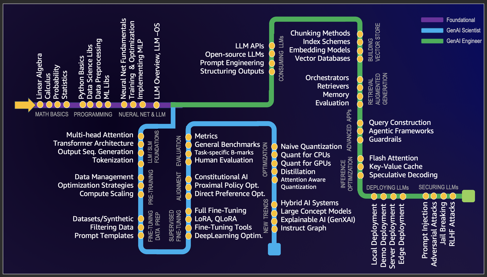

# GenAI Learning Metromap

> Welcome to the GenAI Learning Metromap! Navigating the field of GenAI can often feel daunting due to the interconnected concepts that require prior understanding. This guide aims to streamline the learning journey by mapping out these dependencies, helping to minimize cognitive overload. While there are numerous ways to structure such a learning path, this approach has worked for me. If you have ideas for improvement or alternative perspectives, I welcome your [feedbacks](mailto:spraja08@gmail.com). 

This learning map covers three paths:

1. 📐 **Foundational** - the knowledge needed for everyone including mathematics, Python, and neural networks.
2. 🧑‍🔬 **The GenAI Scientists Path** - focuses on understanding, building and customising LLMs.
3. 👷 **The GenAI Engineers Path** - focuses on creating LLM-based applications, deploying and operating them.

## Foundational

### 1. Math Basics

The core mathematical foundations that power modern AI systems and the concepts required for understanding neural network architectures, optimization algorithms, and probabilistic modeling in machine learning.

* **Linear Algebra:** Crucial for understanding deep learning algorithms. Key concepts include vectors, matrices, determinants, eigenvalues and eigenvectors, vector spaces, and linear transformations
* **Calculus:** Machine learning algorithms involve the optimization of continuous functions, which requires an understanding of derivatives, integrals, limits, and series. Multivariate calculus and the concept of gradients are also important.
* **Probability and Statistics:** For understanding how models learn from data and make predictions. Key concepts include probability theory, random variables, probability distributions, expectations, variance, covariance, correlation, hypothesis testing, confidence intervals, maximum likelihood estimation, and Bayesian inference.

📚 **References:**  
* [Why Machines Learn: The Elegant Math Behind Modern AI](https://a.co/d/3IKwY5X)BOOK
* [StatQuest with Josh Starmer](https://www.youtube.com/@statquest)
* [And ofcourse, the quintessential "3Blue1Brown"](https://www.youtube.com/@3blue1brown)

---
### 2. Programming

Develop hands-on expertise with Python and its data science ecosystem, including skills in data manipulation, visualization, and implementation of machine learning algorithms using industry-standard libraries and frameworks.

* **Python Basics:** A good understanding of the basic syntax, data types, error handling, and object-oriented programming.
* **Data Science Libraries:** Includes NumPy for numerical operations, Pandas for data manipulation and analysis, Matplotlib and Seaborn for data visualization.
* **Data Pre-Processing:** Feature scaling and normalization, handling missing data, outlier detection, categorical data encoding, and splitting data into training, validation, and test sets.
* **Machine Learning Libraries:** Scikit for traditional ML algos and Pytorch for Deeplearning. Understanding how to implement algorithms like linear regression, logistic regression, decision trees, random forests, k-nearest neighbours (K-NN), and K-means clustering is important. Dimensionality reduction techniques like PCA and t-SNE are also helpful for visualizing high-dimensional data

📚 **References:**  
* [Automate the Boring Stuff with Python](https://automatetheboringstuff.com/)  
* [Python for Data Analysis by Wes McKinney](https://wesmckinney.com/book/)FREE BOOK  
* [Introduction to Machine Learning with Python by Andreas Müller and Sarah Guido](https://shop.oreilly.com/product/0636920030515.do)BOOK  
* [Pytorch Tutorials](https://pytorch.org/tutorials/)

---
### 3. Neural Nets & LLMs

Dive into the architecture and mechanics of neural networks and Large Language Models. This section bridges the gap between traditional neural networks and modern transformer-based architectures, providing insights into their training and optimization.

* **Nueral Net Fundamentals:** Components of a neural network such as layers, weights, biases, and activation functions (sigmoid, tanh, ReLU, etc.)
* **Training & Optimization:** Backpropagation and different types of loss functions, like Mean Squared Error (MSE) and Cross-Entropy. Understanding various optimization algorithms like Gradient Descent, Stochastic Gradient Descent, RMSprop, and Adam. Understanding the concept of overfitting (where a model performs well on training data but poorly on unseen data) and learn various regularization techniques (dropout, L1/L2 regularization, early stopping, data augmentation) to prevent it.
* **Implementing MLPs:** Building a Multi Layer Perceptron, also known as a fully connected network, using PyTorch.
* **LLM Overview & LLM-OS:**  The core technical component behind systems like ChatGPT, Claude, and Bard. What they are, where they are headed, comparisons and analogies to present-day operating systems.

📚 **References:**  
* [The Spelled-out Intro to Neural Networks](https://www.youtube.com/watch?v=VMj-3S1tku0&list=PLAqhIrjkxbuWI23v9cThsA9GvCAUhRvKZ)  
* [Intro to Large Language Models](https://www.youtube.com/watch?v=zjkBMFhNj_g&t=2750s)
* [The State of GPT](https://www.youtube.com/watch?v=bZQun8Y4L2A&list=PLAqhIrjkxbuWI23v9cThsA9GvCAUhRvKZ&index=8)
  

---
## GenAI Scientists Path

### 4. LLM/SLM Foundations

Explore the core components that make Large Language Models work, from attention mechanisms to transformer architectures, the internal workings of modern language models and their sequence processing capabilities.

* **Multi-head Attention:** The attention mechanism allows a model to focus on relevant parts of the input sequence when predicting outputs. In Transformers, the Scaled Dot-Product Attention is the core mechanism, where each token attends to every other token in the sequence, weighted by learned relevance scores.
* **Transformer Architecture:** The Transformer is a neural network architecture introduced in the [Attention Is All You Need](https://arxiv.org/abs/1706.03762) paper. It relies entirely on the attention mechanism to draw global dependencies between input and output. It eliminates recurrence and convolutions, allowing for parallelization and scalability in deep learning.
* **Output Sequence Generation:** In sequence-to-sequence tasks (e.g., language translation), the Transformer generates output tokens step-by-step using an autoregressive approach (predicting the next token based on previously generated tokens) or parallel decoding for some applications.
* **Tokenization:** The process of breaking down input text into smaller units (tokens), such as words, subwords, or characters. Models like GPT and BERT use subword tokenization (e.g., Byte Pair Encoding or WordPiece) to handle unknown words and reduce vocabulary size.  

📚 **References:**  
* There is only one place to go - Andrei Karpathy's God level contribution: [Neural Networks: Zero to Hero Playlist](https://www.youtube.com/watch?v=VMj-3S1tku0&list=PLAqhIrjkxbuWI23v9cThsA9GvCAUhRvKZ)

---
### 5. Pre-Training

The techniques for training large language models from scratch, including data management, optimization strategies, and compute scaling. This section covers the critical aspects of building and training foundation models efficiently.

* **Data Management:** Curating large datasets for quality and representation of input data. Understanding how it affects LLM's generalization. 
* **Optimization Strategies:** Large-scale training optimizers(ex. AdamW, LAMB), Regularization methods (ex. LayerNorms, Weight Decay) and Stability techniques(ex. Gradient Clipping, loss scaling)
* **Compute Scaling:** Scaling Law, Parallelism Techniques (model, data, pipelien parallelism) and efficiency techniques including Mixed Prevision, Gradient Checkpointing etc.
  
📚 **References:**  
* [OPENAI's GPT-2 Dataset Documentation](https://openai.com/research/language-models-are-unsupervised-multitask-learners)  
* [LLM DataHub - Curated list of datasets](https://github.com/Zjh-819/LLMDataHub)
* [Training a causal language model from scratch by Hugging Face](https://huggingface.co/learn/nlp-course/chapter7/6?fw=pt) Pre-train a GPT-2 model from scratch using the transformers library.
* [TinyLlama by Zhang et al.](https://github.com/jzhang38/TinyLlama) How a Llama model is trained from scratch.
* [Chinchilla's](https://www.lesswrong.com/posts/6Fpvch8RR29qLEWNH/chinchilla-s-wild-implications) Scaling laws and explain what they mean to LLMs in general.

---
### 6. Fine-Tuning Data Preparation

The art of preparing high-quality datasets for model fine-tuning, including data filtering, synthetic data generation, and prompt engineering. This section focuses on the crucial data preparation steps that determine model performance.

* **Datasets/Synthetic:** High-quality datasets are essential for training. Synthetic datasets, created programmatically, are sometimes used to augment real datasets, especially when domain-specific data is scarce. 
* **Filtering Data:** Filtering ensures the dataset quality by removing noise, duplicates, and irrelevant entries. Techniques include heuristics, model-based filtering, or crowd-sourcing evaluations to ensure that only meaningful data is used for fine-tuning.
* **Prompt Templates:** Prompt templates are pre-designed input formats that help elicit desired responses from language models. These templates structure queries effectively and are critical in few-shot learning or instruction-following tasks.
  
📚 **References:**  
* [Hugging Face Datasets Library](https://huggingface.co/docs/datasets/en/index)Covers practical tools and techniques to gather and prepare datasets, a critical first step in fine-tuning.  
* [Data-Centric AI by Andrew Ng](https://datacentricai.org/) Offers in-depth guidance on applying heuristics, model-based filtering, and other approaches to ensure dataset quality.
* [OpenAI Cookbook on Prompt Design](https://github.com/openai/openai-cookbook#prompts) Demonstrates how structured prompts improve fine-tuning outcomes, especially for instruction-based or few-shot learning tasks

---
### 7. Supervised Fine-Tuning

Advanced techniques for adapting pre-trained models to specific tasks, from full fine-tuning to efficient methods like LoRA and QLoRA. This section covers practical approaches to model adaptation while managing computational resources.

* **Full Fine-Tuning:** Updating all model parameters on a labeled dataset to specialize the model for a specific task. This approach is computationally intensive but yields the best performance for high-resource tasks.
* **LoRA, QLoRA:** LoRA (Low-Rank Adaptation) - Fine-tuning a smaller subset of parameters (low-rank matrices) while freezing most of the model, making it memory-efficient and faster. QLoRA (Quantized LoRA) - An enhancement of LoRA that uses quantization to reduce memory requirements further, enabling fine-tuning of large models on commodity hardware.
* **Fine-Tuning Tools:** Frameworks and libraries that simplify the fine-tuning process by providing pre-built utilities for dataset loading, training loops, and evaluation. Hugging Face's [Parameter-Efficient Fine-Tuning](https://huggingface.co/docs/peft/en/index), [DeepSpeed](https://www.deepspeed.ai/), and [Accelerate](https://github.com/huggingface/accelerate)
* **Deep Learning Optimzation:** Techniques to enhance the efficiency and stability of the training process, such as adaptive optimizers (e.g., AdamW), learning rate schedules, gradient clipping, and distributed training strategies.
  
📚 **References:**  
* [The Ultimate Guide to Fine-Tuning](https://arxiv.org/html/2408.13296v1#Ch1.S5) An exhaustive review of technologies, research & best practices.  
* [The Hugging Face PEFT GitHub repository](https://github.com/huggingface/peft) provides a straightforward way to get started with LoRA using Python code
* [Customize models in Amazon Bedrock with your own data using fine-tuning and continued pre-training](https://aws.amazon.com/blogs/aws/customize-models-in-amazon-bedrock-with-your-own-data-using-fine-tuning-and-continued-pre-training/)
* [DeepSpeed and ZeRO Optimization Techniques](https://www.microsoft.com/en-us/research/blog/deepspeed-extreme-scale-model-training-for-everyone/) - Practical tips for scaling and optimizing training processes.

---
### 8. Alignment

Understand the methods for aligning language models with human values and specific objectives. This section covers techniques like RLHF, Constitutional AI, and preference optimization to ensure models generate helpful and appropriate responses.

Model alignment refers to the process of ensuring that the behavior of a large language model aligns with human values, goals, or specific preferences. Reinforcement Learning with Human Feedback (RLHF) is the broader framework that is used in tailoring the model's responses to be helpful, truthful, and safe, while avoiding undesirable behaviors.

* **Constituitional AI:** A technique developed by Anthropic to align models with ethical principles without relying entirely on human feedback.Models are trained to critique and refine their own outputs based on predefined "constitutional" principles.
* **Proximal Policy Optimization:** Optimizes the model’s policy to maximize the rewards, steering the model towards generating responses that align with human preferences.
* **Direct Preference Optimization:** directly optimizes the model to prefer certain outputs over others, based on pairwise human-provided comparisons.
  
📚 **References:**  
* [Fine-tune Mistral-7b with DPO](https://mlabonne.github.io/blog/posts/Fine_tune_Mistral_7b_with_DPO.html): Tutorial to fine-tune a Mistral-7b model with DPO and reproduce NeuralHermes-2.5.
* [An Introduction to Training LLMs using RLHF](https://wandb.ai/ayush-thakur/Intro-RLAIF/reports/An-Introduction-to-Training-LLMs-Using-Reinforcement-Learning-From-Human-Feedback-RLHF---VmlldzozMzYyNjcy) - Explains why RLHF is desirable to reduce bias and increase performance in LLMs.
* [Preference Tuning LLMs by Hugging Face](https://huggingface.co/blog/pref-tuning): Comparison of the DPO, IPO, and KTO algorithms to perform preference alignment.
* [Illustrating Reinforcement Learning from Human Feedback (RLHF)](https://huggingface.co/blog/rlhf)
* [DPO Github Repo by Hugging Face](https://github.com/huggingface/transformers/tree/main/examples/pytorch/direct_preference_optimization) - Practical examples and implementation of DPO in fine-tuning LLMs. Clear explanations of concepts and Python code.
* [Collective Constitutional AI](https://www.anthropic.com/research/collective-constitutional-ai-aligning-a-language-model-with-public-input) - Anthropic blog on aligning a Language Model with public input

---
### 9. Evaluation

The metrics and methodologies for assessing language model performance, from traditional benchmarks to human evaluation frameworks.

* **Metrics**: Metrics like perplexity and BLEU score are not as popular as they were because they're flawed in most contexts. It is still important to understand them and when they can be applied.
* **General benchmarks**: Based on the [Language Model Evaluation Harness](https://github.com/EleutherAI/lm-evaluation-harness), the [Open LLM Leaderboard](https://huggingface.co/spaces/HuggingFaceH4/open_llm_leaderboard) is the main benchmark for general-purpose LLMs (like ChatGPT). There are other popular benchmarks like [BigBench](https://github.com/google/BIG-bench), [MT-Bench](https://arxiv.org/abs/2306.05685), etc.
* **Task-specific benchmarks**: Tasks like summarization, translation, and question answering have dedicated benchmarks, metrics, and even subdomains (medical, financial, etc.), such as [PubMedQA](https://pubmedqa.github.io/) for biomedical question answering.
* **Human evaluation**: The most reliable evaluation is the acceptance rate by users or comparisons made by humans. Logging user feedback in addition to the chat traces (e.g., using [LangSmith](https://docs.smith.langchain.com/evaluation/capturing-feedback)) helps to identify potential areas for improvement.

📚 **References**:
* [Perplexity of fixed-length models](https://huggingface.co/docs/transformers/perplexity) by Hugging Face: Overview of perplexity with code to implement it with the transformers library.
* [BLEU at your own risk](https://towardsdatascience.com/evaluating-text-output-in-nlp-bleu-at-your-own-risk-e8609665a213) by Rachael Tatman: Overview of the BLEU score and its many issues with examples.
* [A Survey on Evaluation of LLMs](https://arxiv.org/abs/2307.03109) by Chang et al.: Comprehensive paper about what to evaluate, where to evaluate, and how to evaluate.
* [Chatbot Arena Leaderboard](https://huggingface.co/spaces/lmsys/chatbot-arena-leaderboard) by lmsys: Elo rating of general-purpose LLMs, based on comparisons made by humans.

---
### 10. Optimization

Optimization techniques that primarily optimizes memory usage, computational efficiency, and energy consumption. It is a critical method for deploying large models in resource-constrained environments and for scaling inference workloads efficiently.

* **Naive Quantization**: A basic form of model compression that uniformly reduces the numerical precision of all model weights (e.g., from 32-bit floating point to 8-bit integers) without considering the impact on model performance. While simple to implement, this approach can lead to significant accuracy degradation as it doesn't account for the varying sensitivity of different model components.

* **Quantization for CPUs**: A specialized quantization technique optimized for CPU inference that typically uses 8-bit integer (INT8) quantization. This approach includes careful calibration of scaling factors and zero points for each tensor, often utilizing techniques like per-channel quantization and dynamic range adjustment to maintain accuracy while leveraging CPU-specific optimizations.

* **Quantization for GPUs**: A GPU-specific quantization approach that focuses on maintaining computational efficiency while preserving model accuracy. It often employs techniques like FP16 (half-precision) or INT8 quantization with GPU-optimized kernels, and may include features like tensor core utilization and mixed-precision training to balance performance and accuracy.

* **Attention Aware Quantization**: A sophisticated quantization strategy that specifically targets attention mechanisms in transformer models. This method applies different quantization schemes to attention-related computations versus other model components, recognizing that attention layers are particularly sensitive to precision reduction. It often preserves higher precision for key attention operations while allowing more aggressive quantization elsewhere.

* **Distillation**: A model compression technique where a smaller model (student) is trained to mimic the behavior of a larger model (teacher). The student learns not just from the final outputs but also from the teacher's intermediate representations and attention patterns. This approach can significantly reduce model size while maintaining much of the original model's performance, making it particularly valuable for deployment in resource-constrained environments.

📚 **References**:
* [Introduction to Model Quantization](https://pytorch.org/blog/introduction-to-quantization-on-pytorch/) by PyTorch: Clear explanation of quantization basics with code examples.
* [4-bit LLM Quantization with GPTQ](https://mlabonne.github.io/blog/posts/4_bit_Quantization_with_GPTQ.html): Tutorial on how to quantize an LLM using the GPTQ algorithm with AutoGPTQ.
* [Understanding Activation-Aware Weight Quantization](https://medium.com/friendliai/understanding-activation-aware-weight-quantization-awq-boosting-inference-serving-efficiency-in-10bb0faf63a8) by FriendliAI: Overview of the AWQ technique and its benefits.
* [Amazon Bedrock Model Distillation](https://www.youtube.com/watch?v=G4DnZKIlhaA)VIDEO

---
### 11. Emerging Trends

* **Hybrid AI Systems:** Hybrid AI systems combine different types of artificial intelligence, such as deep learning and symbolic reasoning. This integration aims to enhance problem-solving capabilities by leveraging the strengths of various AI approaches. For instance, combining large language models (LLMs) with knowledge graphs can lead to more effective decision-making and reasoning processes, particularly in complex fields like healthcare and finance

* **Large Concept Models:** LCMs focus on processing concepts rather than tokens. This approach allows for more sophisticated reasoning and understanding by treating entire sentences as semantic units, enabling models to operate in a language-independent and multimodal manner

* **GenXAI:** Explainable GenAI (GenXAI) is a field that focusses on exploring how models represent knowledge and to provide human understandable explanations for model's outputs and decisions. The key technics include Mechanistic Interpretability, Feature Attribution, Probing-Based and Sample-Based.

* **Instruct Graph:** Focuses on enhancing LLMs with graph-centric approaches, aiming to improve their performance on graph reasoning and generation tasks. This involves using structured formats to bridge the gap between textual and graph data

📚 **References**:
* [A Beginner's Guide to Hybrid AI Systems](https://www.restack.io/p/hybrid-ai-architectures-answer-beginners-guide-hybrid-ai-systems-cat-ai)
* [Large Concept Models (LCMs) by Meta: The Era of AI After LLMs](https://aipapersacademy.com/large-concept-models/)
* [Explainable Generative AI (GenXAI): A Survey, Conceptualization, and Research Agenda](https://arxiv.org/abs/2404.09554)
* [Interpretable Machine Learning - Christoph Molnar](https://books.google.com.sg/books/about/Interpretable_Machine_Learning.html?id=jBm3DwAAQBAJ&redir_esc=y)
* [InstructGraph](https://aclanthology.org/2024.findings-acl.801.pdf) - Boosting Large Language Models via Graph-centric

---
## GenAI Engineers Path

### 12. Consuming LLMs 

* **LLM APIs:** Understanding and integrating commercial LLM services like OpenAI, Anthropic, and cloud providers' APIs. Learn about authentication, rate limiting, error handling, and cost optimization strategies for production deployments.

* **Open Source LLMs:** Exploring self-hosted models like Llama, Mistral, and Falcon. Understanding deployment options, hardware requirements, and trade-offs between model sizes and capabilities for local or private cloud deployments.

* **Prompt Engineering:** Mastering techniques for crafting effective prompts including few-shot learning, chain-of-thought prompting, and system prompts. Learn best practices for consistent and reliable model outputs.

* **Structuring Outputs:** Techniques for controlling model responses through output parsers, JSON schemas, and structured prompts. Understanding methods to extract specific data formats and maintain consistent response structures.

📚 **References**:
* [OpenAI API Documentation](https://platform.openai.com/docs/introduction) - Comprehensive guide to using OpenAI's API services
* [LangChain Documentation](https://python.langchain.com/docs/get_started/introduction) - Framework for developing applications with LLMs
* [Prompt Engineering Guide](https://www.promptingguide.ai/) - Comprehensive resource for prompt engineering techniques
* [Text Generation Inference](https://huggingface.co/docs/text-generation-inference/index) - Hugging Face's production-ready inference solution
* [LlamaIndex Documentation](https://docs.llamaindex.ai/en/stable/) - Framework for building LLM applications over custom data

---
### 13. Building Vector Store 

* **Chunking Methods:** Techniques for breaking down documents into meaningful segments for vector storage. Includes text splitting strategies like fixed-length chunks, sentence-based splits, and semantic chunking to optimize retrieval effectiveness.

* **Indexing Schemes:** Algorithms and data structures for efficient vector similarity search. Understanding approaches like HNSW (Hierarchical Navigable Small World), IVF (Inverted File Index), and LSH (Locality-Sensitive Hashing) for scalable nearest neighbor search.

* **Embedding Models:** Understanding and selecting appropriate embedding models for converting text to vectors. Includes domain-specific models, multilingual capabilities, and techniques for optimizing embedding quality and computational efficiency.

* **Vector Databases:** Exploring vector database solutions like Pinecone, Weaviate, and Milvus. Understanding their architectures, querying capabilities, scaling considerations, and integration patterns with LLM applications.

📚 **References**:
* [LlamaIndex Guide to Text Chunking](https://docs.llamaindex.ai/en/stable/understanding/putting_it_all_together/chunking.html) - Comprehensive overview of text chunking strategies
* [Understanding HNSW Algorithm](https://www.pinecone.io/learn/series/faiss/hnsw/) - Deep dive into the HNSW indexing algorithm
* [Sentence Transformers Documentation](https://www.sbert.net/) - Guide to state-of-the-art embedding models
* [Vector Database Comparison](https://www.pinecone.io/learn/vector-database-comparison/) - Detailed comparison of popular vector databases
* [Weaviate Learning Center](https://weaviate.io/developers/weaviate) - Practical guides for implementing vector search

---
### 14. Retrieval Augmented Generation (RAG)

* **Orchestrators:** Frameworks like LangChain and LlamaIndex that coordinate the RAG pipeline, managing document processing, retrieval, and LLM interactions. These tools provide abstractions for building complex RAG applications with features like caching, error handling, and monitoring.

* **Retrievers:** Components that fetch relevant information from vector stores using similarity search, hybrid search, or re-ranking techniques. Advanced retrievers may use techniques like query expansion, contextual compression, or multi-step retrieval to improve result quality.

* **Memory:** Systems for maintaining conversation history and managing context windows in RAG applications. Includes short-term memory for ongoing conversations and long-term memory for persistent knowledge across sessions.

* **RAG Evaluation:** Methods for assessing RAG system performance including retrieval accuracy, answer relevance, and faithfulness to source documents. Metrics like RAGAS help evaluate context relevance, answer faithfulness, and overall response quality.

📚 **References**:
* [RAG vs Fine-tuning](https://blog.langchain.dev/rag-vs-finetuning/) - Comprehensive comparison of RAG and fine-tuning approaches
* [Advanced RAG Techniques](https://www.pinecone.io/learn/advanced-rag/) - Deep dive into sophisticated retrieval methods
* [RAGAS: RAG Assessment Framework](https://github.com/explodinggradients/ragas) - Framework for evaluating RAG systems
* [LangChain RAG Tutorial](https://python.langchain.com/docs/use_cases/question_answering/) - Practical guide to building RAG applications
* [Parent Document Retrieval](https://www.llamaindex.ai/blog/parent-child-retrieval) - Advanced retrieval techniques for hierarchical documents

---
### 15. Advanced GenAI Apps

* **Query Construction:** Techniques for dynamically building and optimizing prompts based on user input and context. Includes methods for query decomposition, reformulation, and contextual enhancement to improve response quality and relevance.

* **Agentic AI Apps:** Applications that use LLMs as autonomous agents capable of planning and executing multi-step tasks. Involves tools like AutoGPT and Amazon Bedrock Agents for goal-oriented problem solving, task decomposition, and self-improvement through recursive refinement.

* **Guardrails:** Implementation of safety measures and control mechanisms in GenAI applications. Includes content filtering, output validation, ethical constraints, and monitoring systems to ensure responsible and controlled AI behavior.

📚 **References**:
* [LangChain Expression Language](https://python.langchain.com/docs/expression_language/get_started) - Framework for dynamic prompt construction
* [AutoGPT: An Autonomous GPT-4 Experiment](https://github.com/Significant-Gravitas/AutoGPT) - Popular framework for building autonomous AI agents
* [NeMo Guardrails Documentation](https://github.com/NVIDIA/NeMo-Guardrails) - Comprehensive toolkit for implementing AI safety measures
* [ReAct: Synergizing Reasoning and Acting in Language Models](https://arxiv.org/abs/2210.03629) - Framework for building reasoning agents
* [Amazon Bedrock Multi-agent Collaboration](https://aws.amazon.com/blogs/aws/introducing-multi-agent-collaboration-capability-for-amazon-bedrock/)

---
### 16. Inference Optimization

* **Flash Attention:** A memory-efficient attention algorithm that reduces memory usage and increases speed by tiling attention computation. It optimizes memory access patterns and achieves better hardware utilization, making it particularly effective for training and inference of large language models.

* **Key-Value Cache:** A technique that stores previously computed key and value tensors from the attention mechanism to avoid redundant computations during autoregressive generation. This optimization significantly speeds up inference by reusing intermediate results across generation steps.

* **Speculative Decoding:** An inference optimization method that uses a smaller, faster model to predict multiple tokens in parallel, which are then verified by the main model. This approach can significantly reduce the latency of text generation by parallelizing what is typically a sequential process.

📚 **References**:
* [FlashAttention: Fast and Memory-Efficient Exact Attention with IO-Awareness](https://arxiv.org/abs/2205.14135) - Original paper introducing Flash Attention
* [vLLM: Easy, Fast, and Cheap LLM Serving with PagedAttention](https://github.com/vllm-project/vllm) - Implementation of efficient attention mechanisms
* [Text Generation Inference (TGI)](https://github.com/huggingface/text-generation-inference) - Hugging Face's optimized inference server
* [Fast Transformer Inference with Better Attention](https://pytorch.org/blog/better-transformer-inference/) - PyTorch's guide to optimized transformer inference

---
### 17. Deploying LLMs

* **Local Deployment:** Techniques for deploying LLMs on local machines, including CPU and GPU optimizations, memory management, and containerization. Understanding hardware requirements, model quantization, and local inference servers for optimal performance.

* **Demo Deployment:** Methods for quickly deploying LLM applications for demonstration purposes using platforms like Hugging Face Spaces, Streamlit, or Gradio. These platforms offer easy-to-use interfaces for showcasing LLM capabilities with minimal setup.

* **Server Deployment:** Strategies for deploying LLMs in production environments using cloud services or on-premises infrastructure. Includes load balancing, auto-scaling, monitoring, and high-availability configurations for reliable service delivery.

* **Edge Deployment:** Techniques for deploying optimized LLMs on edge devices with limited resources. Focuses on model compression, efficient inference, and device-specific optimizations for mobile phones, IoT devices, and embedded systems.

📚 **References**:
* [vLLM Production Deployment Guide](https://docs.vllm.ai/en/latest/serving/deploying_with_kubernetes.html) - Comprehensive guide for deploying LLMs at scale
* [Gradio Documentation](https://www.gradio.app/docs/interface) - Framework for creating demo interfaces for ML models
* [TensorRT-LLM](https://github.com/NVIDIA/TensorRT-LLM) - NVIDIA's toolkit for optimizing LLM inference
* [AWS SageMaker Deployment Guide](https://docs.aws.amazon.com/sagemaker/latest/dg/deploy-model.html) - Best practices for deploying ML models in production
* [TinyLLM: Edge Deployment of LLMs](https://github.com/jzhang38/TinyLlama) - Guide to deploying compact LLMs on edge devices

---
### 18. Securing LLMs

* **Prompt Injection:** Malicious inputs designed to manipulate LLM behavior by bypassing safety measures. Attackers craft prompts that trick the model into performing unintended actions or revealing sensitive information.

* **Adversarial Attacks:** Carefully crafted inputs that cause the model to produce incorrect or harmful outputs. These can exploit model vulnerabilities to generate misleading or inappropriate responses.

* **Jailbreaking:** Methods to bypass model safety measures and restrictions. Attackers use creative prompting techniques to make models generate content that violates their intended constraints.

* **RLHF Attacks:** Exploits targeting the reinforcement learning from human feedback mechanism. These attacks aim to manipulate the model's learned preferences and alignment.

📚 **References**:
* [LLM Security: Understanding and Mitigating Security Risks](https://arxiv.org/abs/2310.11414) - Comprehensive overview of LLM security challenges and defenses
* [Prompt Injection Attacks and Defenses](https://www.microsoft.com/en-us/security/blog/2024/01/23/prompt-injection-attacks-and-defenses-in-llm-based-applications/) - Microsoft's guide to understanding and preventing prompt injection
* [Adversarial Machine Learning in LLMs](https://github.com/microsoft/adversarial-machine-learning-llm) - Microsoft's collection of resources on adversarial attacks
* [Red Teaming Language Models](https://huggingface.co/blog/red-teaming) - Hugging Face's guide to testing LLM security
* [Constitutional AI: A Guide to Safe LLM Development](https://www.anthropic.com/index/constitutional-ai-the-next-step) - Anthropic's approach to building safer AI systems

---

🧠 Happy learning! 🥳